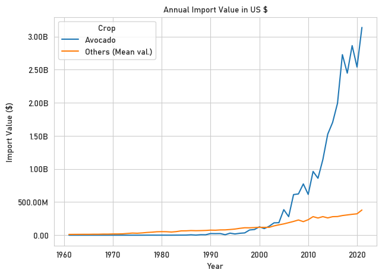

# U.S. Demand for Avocados and Conflict in Producing Regions

 

## Why Avocados

Avocados are considered part of a loosely defined group of foods high in nutritional content known as “Superfoods”. According to Harvard Medical School there are many crops that qualify as superfoods that are grown domestically in the United States. Legumes, cruciferous vegetables, and whole grains are all examples of which the US produces plenty. The US as the top importer of Avocados globally (over $3 billion imported in 2020 alone) creates an incredible demand for Avocados.

Using data on production volume and import value I am going to investigate how change in demand affects major avocado producing regions.
